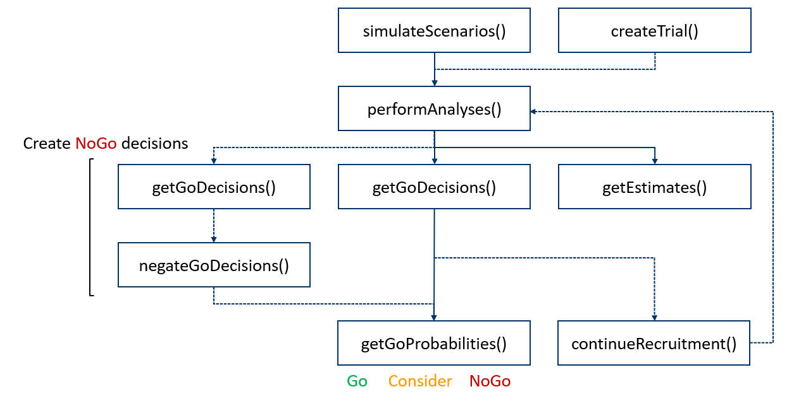

```{r setup, include=FALSE}
knitr::opts_chunk$set(echo = TRUE, eval = TRUE)
```

This guide provides an overview of the R package [bhmbasket](https://cran.r-project.org/web/packages/bhmbasket/index.html) on how to use its functions to evaluate the operating characteristics of a basket trial with binary endpoints.
An example trial will be used to guide through the functions.
The design of the trial is depicted in Figure 1.
The example trial consists of three cohorts where the third cohort is already observed historical data.
Cohorts 1 and 2 will be analyzed in a futility analysis using simple Bayesian Go/NoGo decision rules after 10 and 15 subjects have been recruited in Cohorts 1 and 2, respectively.
Based on the futility analysis, the recruitment will continue until 15 additional subjects are recruited in each cohort.
The final analysis will be performed with a Go/NoGo decision making framework as proposed by @fisch2015.


<center>
  
Figure 1: Trial design
</center>


## Overview and Workflow
Figure 2 depicts the main functions and the workflow of the package.
The first step is to simulate scenarios with `simulateScenarios()`.
The simulated trial outcomes are analyzed with Bayesian hierarchical models (BHMs) using `performAnalyses()`.
The user can then specify and apply the decision rules with `getGoDecisions()` and can subsequently calculate decision probabilities using `getGoProbabilities()` and recruit additional patients with `continueRecruitment()` for later analyses.

<center>

  
Figure 2: Workflow of bhmbasket <br>
*Solid lines: core functions; dashed lines: optional functions*
</center>


## Prerequisites
```{r, message=FALSE, warning=FALSE}
library(bhmbasket)
set.seed(677643)
```

The function `performAnalyses()` is set up for parallel execution, which can be leveraged by providing a parallel backend that is accepted by the foreach framework, as e.g. provided by the R package [doFuture](https://cran.r-project.org/web/packages/doFuture/vignettes/doFuture.html):

```{r, message=FALSE, warning=FALSE}
library(doFuture)

registerDoFuture()
plan(multisession)
```

## Simulation of Scenarios
The function `simulateScenarios()` is used to simulate data according to scenarios.
For each scenario, one must provide the number of subjects and the true response rates per cohort.
Also observed, historical data can be included in the simulated trial outcomes.

This example consists of four scenarios and three cohorts, with the third cohort being historical with an observed number of five responders out of 15 subjects.
The trial design will be investigated with a positive scenario, two nugget scenarios, and a negative scenario.
The positive and negative scenarios cover the true highest and lowest response rates that lead to a continuation or stop of the development of the drug, respectively.
In the nugget scenarios, only one of the cohorts assumes the response rate of the positive scenario, whereas the other cohorts assume the response rates of the negative scenario. 

```{r}
scenarios <- list(
  rr_positive = c(0.2, 0.35, 5),
  rr_nugget1  = c(0.2, 0.15, 5),
  rr_nugget2  = c(0.05, 0.35, 5),
  rr_negative = c(0.05, 0.15, 5))


scenario_list <- simulateScenarios(
  n_subjects_list     = c(15, 10, 15),
  response_rates_list = scenarios)

scenario_list
```

Note that the argument `n_subjects_list` also takes a vector for the case that each scenario consists of the same number of subjects.
<!-- The function distinguishes historical data from the data to be simulated by the response rate argument. -->
<!-- If the vector providing the scenario response rates contains an integer, it will be identified as the number of historical responders.   -->
<!-- If the number of subjects is not the same for all scenarios, one has to provide a list of vectors with the number of subjects of each scenario. -->

### Observed Outcome Data
<!-- Also actual trial outcomes can be analyzed with [bhmbasket](https://cran.r-project.org/web/packages/bhmbasket/index.html). -->
An observed trial outcome can be specified with the function `createTrial()` as shown below.

```{r}
trial_outcome <- createTrial(n_subjects   = c(10, 20, 30, 40),
                             n_responders = c( 1,  2,  3,  4))
```

The created trial outcome can be processed in the same way as the simulated trial outcomes generated by `simulateScenarios()`.

## Analyses
The function [`performAnalyses()`](https://search.r-project.org/CRAN/refmans/bhmbasket/html/performAnalyses.html) approximates the joint posterior distribution for each trial realization via MCMC sampling and returns the quantiles of the marginal posterior response rates and of other model parameters.
Required arguments are a scenario list created e.g. with `simulateScenarios()`, the name of at least one analysis method and the target rates per cohort.
Optionally, cohorts can be specified for which differences in marginal response rate distributions should be calculated.

```{r, eval = FALSE}
analysis_list <- performAnalyses(
  scenario_list    = scenario_list,
  method_names     = c("berry", "exnex_adj", "stratified"),
  target_rates     = c(0.2, 0.35, 0.3),
  calc_differences = c(2, 1))

analysis_list
```

```{r, echo=FALSE}
if (file.exists("analyses_lists/gettingStarted_analysis_1.rds")) {
  
  analysis_list <- readRDS("analyses_lists/gettingStarted_analysis_1.rds")
} else {
  
  analysis_list <- performAnalyses(
  scenario_list    = scenario_list,
  method_names     = c("berry", "exnex_adj", "stratified"),
  target_rates     = c(0.2, 0.35, 0.3),
  calc_differences = c(2, 1))
  
  saveRDS(analysis_list, "analyses_lists/gettingStarted_analysis_1.rds")
}

analysis_list
```

```{r, include = FALSE}
# check for unnecessary data
if (any(grepl("w_",
              colnames(analysis_list$scenario_1$quantiles_list$exnex[[1]])))) {   
  
  # remove unnecessary data  
  analysis_list$scenario_1$quantiles_list$exnex_adj <-   lapply(analysis_list$scenario_1$quantiles_list$exnex_adj, function (x) {
    x[ , -c(1:3)]
  })  
  analysis_list$scenario_2$quantiles_list$exnex_adj <-   lapply(analysis_list$scenario_2$quantiles_list$exnex_adj, function (x) {
    x[ , -c(1:3)]
  })  
  analysis_list$scenario_3$quantiles_list$exnex_adj <-   lapply(analysis_list$scenario_3$quantiles_list$exnex_adj, function (x) {
    x[ , -c(1:3)]
  })
  analysis_list$scenario_4$quantiles_list$exnex_adj <-   lapply(analysis_list$scenario_4$quantiles_list$exnex_adj, function (x) {
    x[ , -c(1:3)]
  })

 # save modified analysis list
 saveRDS(analysis_list, "analyses_lists/gettingStarted_analysis_1.rds", compress = "xz")
}
```

Available methods are the BHM proposed by @berry2013 (*berry*), the model proposed by @exnex2016 (*exnex*), and a BHM that combines both approaches called ExNex adjusted (*exnex_adj*), as well as two beta-binomial approaches called *pooled* and *stratified*.
The target rates are required for the methods *berry* and *exnex_adj* as well as for setting default prior parameters for the analysis models.
One can use [`getPriorParameters()`](https://search.r-project.org/CRAN/refmans/bhmbasket/html/getPriorParameters.html) and the `setPriorParameters...()` family of functions for a custom choice of prior parameters.
In case further evidence levels are required, they can be provided in addition to the default evidence levels with the argument `evidence_levels`.
Posterior differences of cohorts' response rates can be calculated using the argument `calc_differences`.
For example, for the difference between cohorts x and y, one uses `calc_differences = c(x, y)`.
This can be used to compare outcomes of cohorts directly, e.g. when comparing cohorts with monotreatment and cohorts with combination treatment.
Note that several differences can be specified by providing a matrix.

### Getting Estimates   
The user can get estimates of the model parameters with [`getEstimates()`](https://search.r-project.org/CRAN/refmans/bhmbasket/html/getEstimates.html). 
The standard parameters are point estimates and credible intervals per cohorts, as well as estimated biases and mean squared errors of the point estimators.
The list of shown parameters can be expanded by additional model parameters using the argument `add_parameters`.
  
```{r}
estimates <- getEstimates(
  analyses_list  = analysis_list,
  add_parameters = c("mu", "tau"))

round(estimates$exnex_adj$scenario_3, digits = 2)
```
  
## Decision Making  
Go/NoGo decision rules can be implemented with [`getGoDecisions()`](https://search.r-project.org/CRAN/refmans/bhmbasket/html/getGoDecisions.html).
The function calculates Go decisions for each cohort of a trial outcome based on decision rules.
The resulting decision list can be used to calculate the cohort-wise and overall decision probabilities using the functions [`negateGoDecisions()`](https://search.r-project.org/CRAN/refmans/bhmbasket/html/negateGoDecisions.html) and [`getGoProbabilities()`](https://search.r-project.org/CRAN/refmans/bhmbasket/html/getGoProbabilities.html).

### Implementation of Decision Rules in General

A simple Bayesian decision rule is
$$P(p_j|\text{data} > p_{Bj}) > \gamma_j,$$

where $p_j|\text{data}$ is the posterior response rate of cohort $j$ and $\gamma_j$ and $p_{Bj}$ are its evidence level and decision boundary, respectively. 
This rule may be rewritten as follows
$$q_{1-\gamma_j} > p_{Bj},$$
where $q_{1-\gamma_j}$ is the 1-$\gamma$-quantile of the posterior response rate of cohort $j$.

As keeping the MCMC samples or marginal posterior densities of the parameters of interest would require too much memory, only pre-specifed quantiles of the MCMC samples are stored when applying [`performAnalyses()`](https://search.r-project.org/CRAN/refmans/bhmbasket/html/performAnalyses.html).

#### Example Decision Rule
To implement such a decision rule with `getGoDecisions()`, three arguments are used, namely the `cohort_names`, the `evidence_levels`, and the `boundary_rules`.

As an example, the decision rules $P(p_1|\text{data} > 0.1) > 0.5$ and $P(p_2|\text{data} > 0.2) > 0.9$ would be implemented with the arguments of `getGoDecisions()` as follows:

```{r, eval=FALSE}
cohort_names    = c('p_1', 'p_2')
evidence_levels = c(0.5, 0.9)
boundary_rules  = quote(c(x[1] > 0.1), x[2] > 0.2)
```

The first evidence level `0.5` and the first cohort name `p_1` are addressed by `x[1]`.
Accordingly, the evidence level `0.9` and the second cohort name `p_2` are addressed by `x[2]`.
Inside the quote for the boundary rule, `x[1]` and `x[2]` can be used in any order or repeated as often as required, and the rules can be nested, or conditioned.
This makes this approach very flexible for implementing many different and potentially complex decision rules.


#### Futility Analysis
The first decision making in this example is part of the futility analysis.
The function `getGoDecisions()` creates the Go decisions for the specified cohorts with the rules outlined above:  

* Cohort 1: $P(p_1|\text{data} > 0.11) > 0.5$  
* Cohort 2: $P(p_2|\text{data} > 0.22) > 0.5$  

Note that there must be a decision rule specified for each cohort in the trial, i.e., the vector in the quote must have the same length as the number of cohorts in the trial. 
In this example, the third cohort should not get a decision.
Therefore, the argument `boundary_rules` contains the value `TRUE` on the third position.
To assess the overall futility operating characteristics, the required number of cohort-wise Go decisions for an overall Go is increased to two.

```{r}
futility_decision_list <- getGoDecisions(
  analyses_list   = analysis_list,
  cohort_names    = c("p_1", "p_2"),
  evidence_levels = c(0.5, 0.5),
  boundary_rules  = list(quote(c(x[1] > 0.12,
                                 x[2] > 0.22,
                                 TRUE))),
  overall_min_gos = 2)
```

The function `getGoProbability()` calculates the cohort-wise Go probabilities based on the previously created decisions list.
Optionally providing a NoGo decisions list, `getGoProbability()` calculates also Consider and NoGo decision probabilities.

```{r}
futility_go_probabilities <- getGoProbabilities(
   go_decisions_list = futility_decision_list)

scaleRoundList(futility_go_probabilities, round_digits = 2)
```

To compare the performance of different analysis models, it is possible to set up different decision rules for each method to calculate similar decision probabilities for a certain scenario.
In the example below, rules are specified for similar Go probabilities to compare the false Go probabilities of the different models (Scenario 4).

```{r}
decision_list_adj <- getGoDecisions(
  analyses_list   = analysis_list,
  cohort_names    = c("p_1", "p_2"),
  evidence_levels = c(0.5, 0.5),
  boundary_rules  = list(quote(c(x[1] > 0.14,
                                 x[2] > 0.24,
                                 TRUE)),      #berry
                         quote(c(x[1] > 0.1,
                                 x[2] > 0.21,
                                 TRUE)),      #exnex adjusted
                         quote(c(x[1] > 0.07,
                                 x[2] > 0.19,
                                 TRUE))),     #stratified
  overall_min_gos = 2)

decision_list_adj
```
In the negative scenario, the false Go probabilities of the method Stratified are comparatively high with an overall Go probability of 55%, and 18% and 46% cohort-wise false go probability in Cohorts 1 and 2, respectively.
Using the model ExNex adjusted leads to false Go probabilities of 18% in Cohort 1 and 23% in Cohort 2.
The false Go probability of Cohort 1, using the model proposed by @berry2013, is 7 percentage points lower compared to the probability when using the model ExNex adjusted.

The differences between the models can be attributed to the different amounts of borrowing of information between the cohorts.
The more borrowing, the smaller the false Go probability in the negative scenario.
Using the method Stratified leads to the highest false Go probabilities, due to the absence of borrowing.
In this scenario, the model proposed by @berry2013 leads to the highest amount of borrowing and therefore, to the best outcome.

### Continue Recruitment
After an analysis as above, one can continue the recruitment and add more subjects to the cohorts.
The function [`continueRecruitment()`](https://search.r-project.org/CRAN/refmans/bhmbasket/html/continueRecruitment.html) is used to add a specified number of subjects to the current number of subjects of the simulated cohorts.
`continueRecruitment()` only allows to add subjects according to one method.
In this case, ExNex adjusted will be used to continue the recruitment.

```{r, message=FALSE, warning=FALSE}
final_scenario_list <- continueRecruitment(
  n_subjects_add_list = c(15, 15),
  decisions_list      = futility_decision_list,
  method_name         = "exnex_adj")

final_scenario_list
```

```{r, eval = FALSE}
final_analysis_list <- performAnalyses(
  scenario_list    = final_scenario_list, 
  method_names     = "exnex_adj",
  calc_differences = c(2, 1),
  target_rates     = c(0.2, 0.35, 0.3))

final_analysis_list
```

```{r, echo=FALSE}
if (file.exists("analyses_lists/gettingStarted_analysis_2.rds")) {
  
  final_analysis_list <- readRDS("analyses_lists/gettingStarted_analysis_2.rds")
  
} else {
  
  final_analysis_list <- performAnalyses(
  scenario_list    = final_scenario_list, 
  method_names     = "exnex_adj",
  calc_differences = c(2, 1),
  target_rates     = c(0.2, 0.35, 0.3))
  
  saveRDS(final_analysis_list, "analyses_lists/2gettingStarted_analysis_2.rds")
}

final_analysis_list
```

```{r, include = FALSE}
# check for unnecessary data
if (any(grepl("w_",
              colnames(final_analysis_list$scenario_1$quantiles_list$exnex[[1]])))) {  
  # remove unnecessary data
  final_analysis_list$scenario_1$quantiles_list$exnex_adj <-   lapply(final_analysis_list$scenario_1$quantiles_list$exnex_adj, function (x) {
    x[ , -c(1:4, 8)]
  })
  final_analysis_list$scenario_2$quantiles_list$exnex_adj <-   lapply(final_analysis_list$scenario_2$quantiles_list$exnex_adj, function (x) {
    x[ , -c(1:4, 8)]
  })
  final_analysis_list$scenario_3$quantiles_list$exnex_adj <-   lapply(final_analysis_list$scenario_3$quantiles_list$exnex_adj, function (x) {
    x[ , -c(1:4, 8)]
  })
  final_analysis_list$scenario_4$quantiles_list$exnex_adj <-   lapply(final_analysis_list$scenario_4$quantiles_list$exnex_adj, function (x) {
    x[ , -c(1:4, 8)]
  })
  
  ##subjects, responders and post_quantiles
  for(s in seq_along(scenarios_list)) {
    final_analysis_list[[s]]$scenario_data$n_responders <- NULL
    final_analysis_list[[s]]$scenario_data$previous_analyses$post_quantiles <- NULL
    final_analysis_list[[s]]$scenario_data$n_trials <- NULL
  }
  rm(s)

# save modified analysis list  
   saveRDS(final_analysis_list, "analyses_lists/gettingStarted_analysis_2.rds", compress = "xz")
}
```

Only the simulated trial outcomes with an overall Go decision will get additional subjects in the cohorts with cohort-wise Go decisions and only those trial outcomes will be analysed again in `performAnalyses()`.

Due to the different numbers of subjects in the trials, the decision rules can be assessed with regard to the average number of subjects across the different scenarios using `getAverageNSubjects()`.
```{r}
getAverageNSubjects(
  scenario_list = final_scenario_list
  )
```

### Final Decision Making
In this example, decision making as proposed by @fisch2015 is implemented for the final analysis.
This approach leads to a three-way decision making framework with Go, Consider, and NoGo outcomes.
For each cohort, two decision rules labeled significance and relevance are specified.
For a Go decision for a cohort, both the relevance and the significance rules of that cohort must be fulfilled.
If both rules are false, the decision will be a NoGo, and if either the relevance or the significance rule is true (and not both), the decision for that Cohort is Consider.

#### Implementation of Decision Rules According to Fisch et al. (2015)
Decision rules following the framework proposed by @fisch2015 are implemented in a similar way as described above.
<!-- To get a Consider decision and its probability, it is not enough to just negate the Go decision list, using `negateGoDecisions(decision_list)`. -->
<!-- It is necessary to set up another set of decision rules and negate them afterwards. -->
For each cohort, the Go and NoGo decision rules are a combination of the relevance ($R$)  and significance ($S$) rules of that cohort:

* Go: $R ∧ S$   
* NoGo: $-R ∧ -S  = -(R ∨ S)$  
* else Consider

To implement the NoGo rule $-(R ∨ S)$, the function `negateGoDecisions()` can be used in conjunction with `getGoDecisions()`.
As an example, decision rules applying the relevance rule $P(p_1|\text{data} > 0.4) > 0.5$ and the significance rule $P(p_1|\text{data} > 0.2) > 0.95$ can be implemented as follows:
```{r, eval=FALSE}
cohort_names    = c('p_1', 'p_2',
                    'p_1', 'p_2')

evidence_levels = c(0.5,  0.5,
                    0.95, 0.95)

# argument for first call of getGoDecisions()
go_boundary_rules   = quote(c(x[1] > 0.4 & x[3] > 0.2, 
                              x[2] > 0.4 & x[4] > 0.2)

# argument for second call of getGoDecisions() with negateGoDecisions()
nogo_boundary_rules = quote(c(x[1] > 0.4 | x[3] > 0.2, 
                              x[2] > 0.4 | x[4] > 0.2)
```

#### Final Analysis of the Example Trial
For the final analysis of this example, the decision rules for Cohort 1 for relevance and significance are $P(p_1|\text{data} > 0.167) > 0.5$ and $P(p_1|\text{data} > 0.05) > 0.8$, respectively.
For Cohort 2, the relevance criterion $P(p_2|\text{data} > 0.29) > 0.5$ ∧ $P(p_2-p_1|\text{data} > 0) > 0.5$ is a combination of rules for the point estimate and for the difference between Cohorts 2 and 1.
The rule for significance for Cohort 2 is $P(p_2|\text{data} > 0.15) > 0.8$.
The third cohort should not get a decision as in the futility analysis.

```{r}
final_decision_list <- getGoDecisions(
  analyses_list   = final_analysis_list,
  cohort_names    = c("p_1", "p_2", "p_diff_21", 
                      "p_1", "p_2"),
  evidence_levels = c(0.5, 0.5, 0.5,
                      0.8, 0.8),
  boundary_rules  = quote(c(x[1] > 0.167            & x[4] > 0.05,
                            x[2] > 0.29  & x[3] > 0 & x[5] > 0.15, 
                            TRUE)),
  overall_min_gos = 2)


final_nogo_decision_list <- negateGoDecisions(
  getGoDecisions(
    analyses_list   = final_analysis_list,
    cohort_names    = c("p_1", "p_2", "p_diff_21", 
                        "p_1", "p_2"),
    evidence_levels = c(0.5, 0.5, 0.5,
                        0.8, 0.8), 
    boundary_rules  = quote(c(x[1] > 0.167            | x[4] > 0.05,
                              x[2] > 0.29  & x[3] > 0 | x[5] > 0.15,
                              TRUE)),
    overall_min_gos = 2),
  overall_min_nogos = 2)


final_probability_list <- getGoProbabilities(
  go_decisions_list = final_decision_list,
  nogo_decisions_list = final_nogo_decision_list)

scaleRoundList(final_probability_list, round_digits = 2)
```
In this case, the specified decision rules lead to an overall Go probability of 84% and individual Go probabilities of 65% in Cohort 1 and 72% in Cohort 2 in the positive scenario. 
The probabilities of identifying the nugget cohorts are 55% and 60%, respectively.
In the negative scenario, the overall false Go probability is 2%.
Note that there is a trade-off between targeted decision probabilities and sample size.

## References
